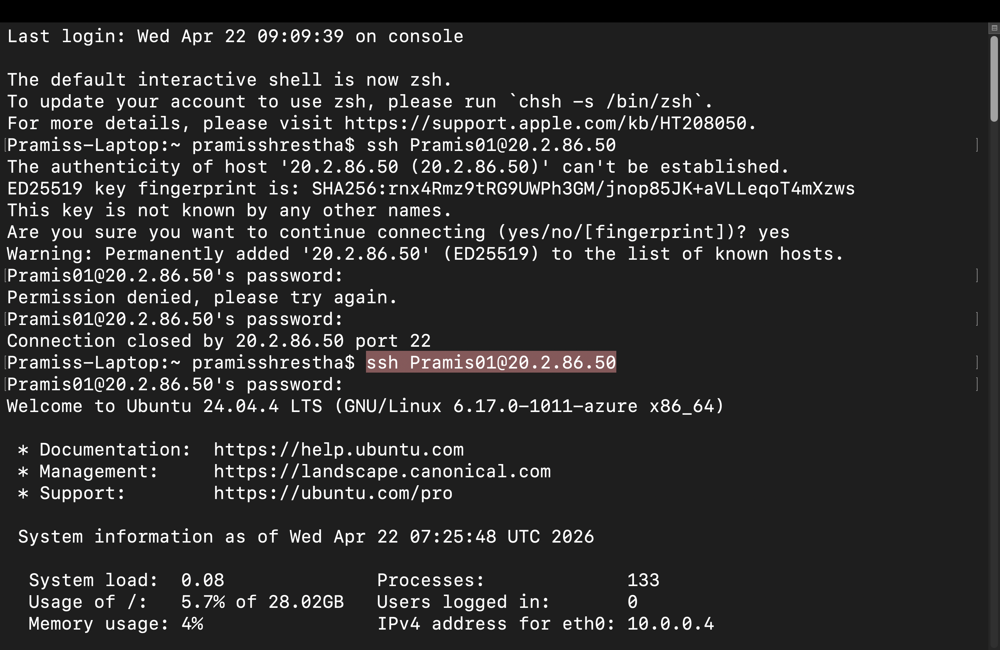
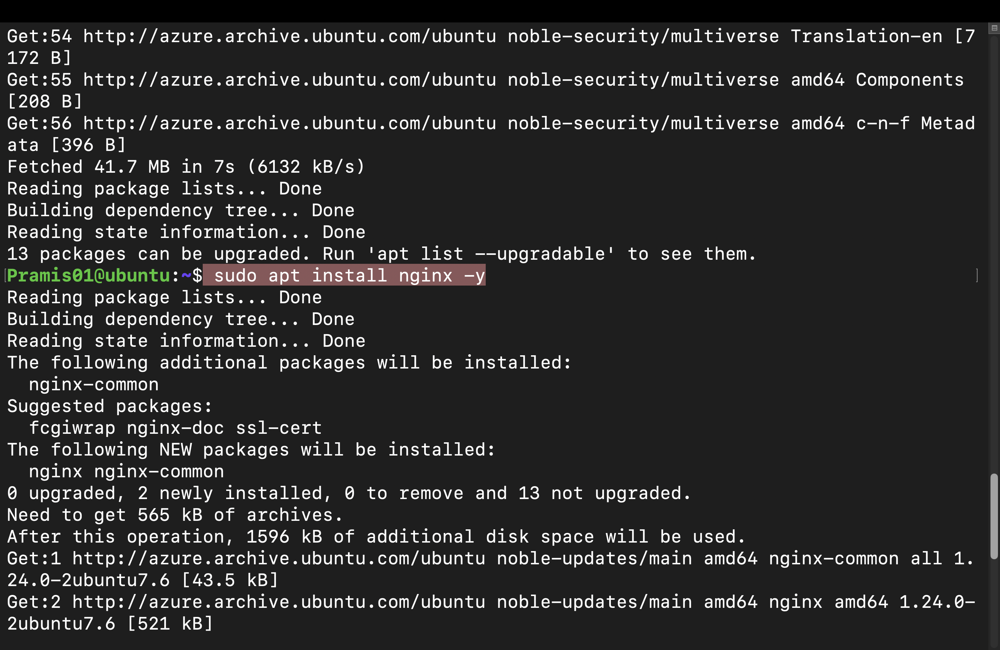
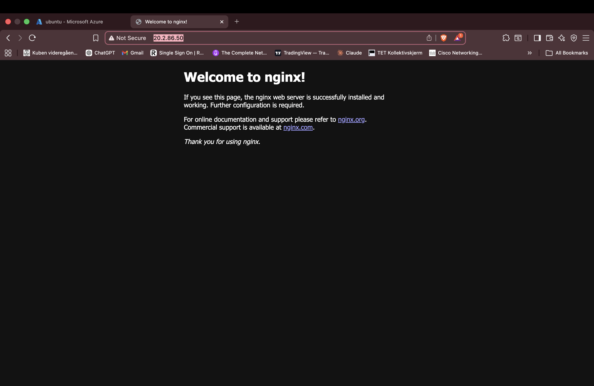

# Azure Fordypningsprosjekt – Azure CLI

## Prosjektoversikt

Dette prosjektet er en del av mitt fordypningsfag, hvor jeg lærer å bruke skytjenester gjennom Microsoft Azure. Fokus så langt har vært på bruk av Azure CLI for å administrere ressurser.

---

## Hva jeg har lært

### Installasjon av Azure CLI

For å kunne bruke Azure fra terminalen på Mac, installerte jeg Azure CLI ved hjelp av Homebrew.

Kommando:

```
brew install azure-cli
```

Dette installerer Azure CLI slik at jeg kan kjøre Azure-kommandoer direkte fra terminalen.

---

### Innlogging i Azure via CLI

Etter installasjonen koblet jeg Azure-kontoen min til CLI.

Kommando:

```
az login
```

Når jeg kjørte kommandoen, ble jeg sendt videre til nettleseren hvor jeg logget inn med Microsoft-kontoen min. Etter innlogging ble kontoen koblet til terminalen.

---

### Valg av abonnement (Subscription)

Etter innlogging måtte jeg velge hvilket abonnement jeg skulle bruke. Jeg har et gratis abonnement, og valgte dette.

Dette abonnementet brukes når jeg oppretter og administrerer ressurser i Azure.

---

### Opprettelse av Resource Group

#### Hva er en Resource Group

En Resource Group er en samling av ressurser i Azure, for eksempel virtuelle maskiner, databaser og nettverk. Den brukes til å organisere og administrere relaterte ressurser.

#### Kommando brukt

```
az group create --name Project-Name --location northeurope
```

#### Forklaring

* `--name`: Navnet på resource groupen
* `--location`: Hvilken region ressursene blir opprettet i

---

### Vise liste over Resource Groups

For å se hvilke resource groups jeg har opprettet, brukte jeg følgende kommando:

```
az group list --output table
```

#### Forklaring

* Viser alle resource groups i abonnementet
* `--output table` gjør at resultatet vises som en tabell, som er lettere å lese

---

### Slette en Resource Group

For å slette en resource group brukte jeg følgende kommando:

```
az group delete --name Project-Name --yes
```

#### Forklaring

* `--name`: Navnet på resource groupen som skal slettes
* `--yes`: Bekrefter slettingen automatisk uten ekstra spørsmål

Når en resource group slettes, blir alle ressursene som ligger inni også slettet.

---

## Refleksjon

Gjennom dette arbeidet har jeg lært grunnleggende bruk av Azure CLI, hvordan jeg kobler til en konto, og hvordan jeg kan opprette, vise og slette ressurser. Dette gir en god forståelse for hvordan man kan administrere skyressurser på en strukturert måte.

## Virtuell maskin (VM)

### Opprettelse av virtuell maskin

Jeg opprettet en virtuell maskin ved hjelp av Azure-portalen i Microsoft Azure. Under opprettelsen valgte jeg et Ubuntu-operativsystem. Prosessen ligner på opprettelse av en vanlig virtuell maskin, hvor man må konfigurere blant annet lagring, nettverk og brukerinformasjon.

Jeg valgte brukernavn og passord som senere ble brukt for innlogging til serveren.

---

### Tilkobling til VM via SSH

Etter at den virtuelle maskinen var opprettet, kopierte jeg den offentlige IP-adressen (Public IP). Denne brukes for å koble til serveren eksternt.

Jeg koblet til VM-en via terminalen ved hjelp av SSH med følgende kommando:

```id="vmssh01"
ssh Pramis01@20.2.86.50
```

Her er:

* `Pramis01` brukernavnet jeg opprettet
* `20.2.86.50` den offentlige IP-adressen til VM-en

Ved første tilkobling måtte jeg bekrefte forbindelsen og deretter skrive inn passordet jeg valgte under opprettelsen.

**Skjermbilde: SSH-tilkobling i terminal **


---

### Oppdatering av system og installasjon av Nginx

Når jeg var koblet til serveren, oppdaterte jeg først pakkelisten for systemet:

```id="vmcmd01"
sudo apt update
```

Deretter installerte jeg webserveren Nginx:

```id="vmcmd02"
sudo apt install nginx -y
```

Dette installerer og setter opp en enkel webserver på den virtuelle maskinen.

**Skjermbilde: Installasjon av Nginx i terminal**


---

### Testing av webserver

Etter installasjonen testet jeg webserveren ved å åpne den offentlige IP-adressen i en nettleser. Hvis installasjonen var vellykket, vises standard Nginx-side.

Dette bekrefter at serveren er tilgjengelig over internett og at webserveren fungerer som forventet.

**Skjermbilde: Nginx standard side i nettleser**

---

## Refleksjon

Gjennom dette arbeidet har jeg lært hvordan man oppretter og konfigurerer en virtuell maskin i Azure, samt hvordan man kobler til en server ved hjelp av SSH. Jeg har også fått praktisk erfaring med Linux-kommandoer og installasjon av tjenester som Nginx.

Jeg har forstått viktigheten av offentlig IP-adresse for ekstern tilgang, og hvordan en server kan brukes til å levere tjenester over nettverk.
